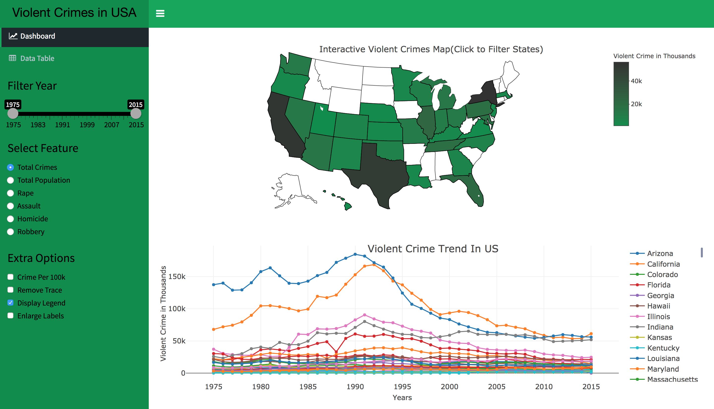
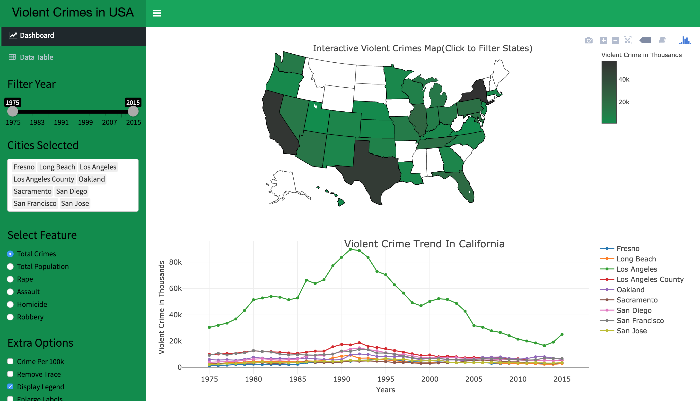
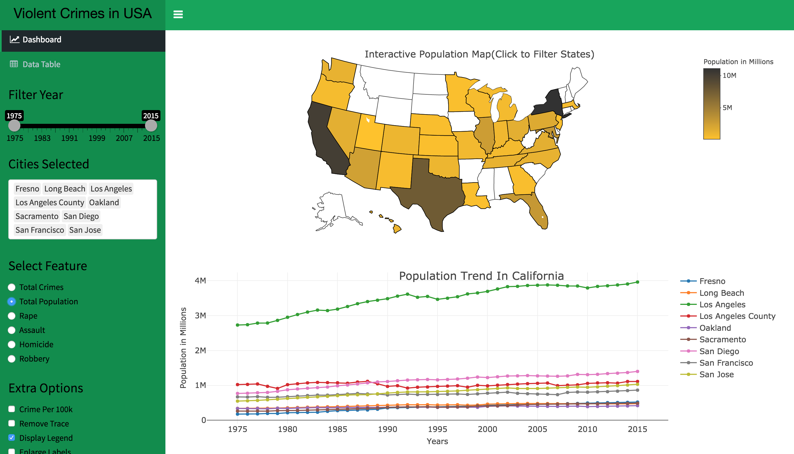
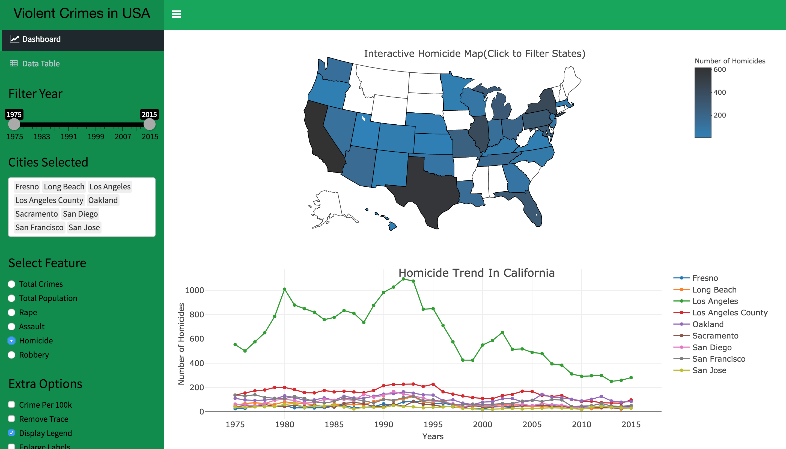
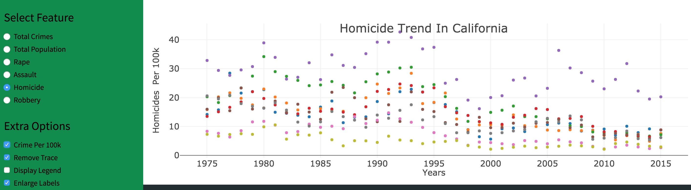
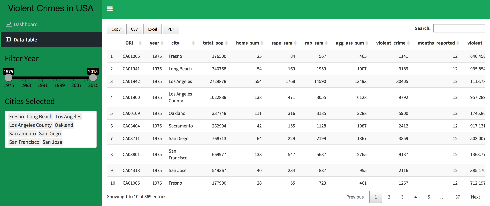
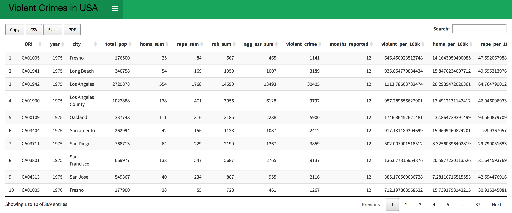
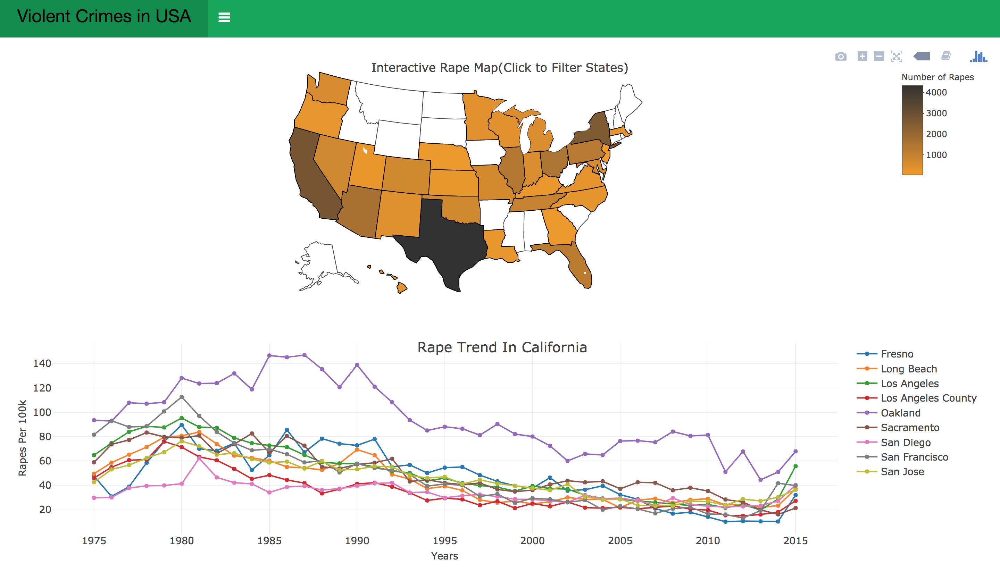

# Shiny App for Visualizing the Marshall Violent Crime Dataset

**Shiny App** -> [**Marshall Violent Crimes**](https://avinashkz.shinyapps.io/marshall_violent_crimes/)

## Description of Data

The dataset I am using for this application is the [Marshall Violent Crime](https://github.com/themarshallproject/city-crime) Dataset. The dataset has nearly 3,000 records of the most serious violent crimes in 68 police jurisdictions from 1975 to 2015. The crimes that are considered most serious are homicide, rape, robbery and assault. The majority of the police agencies from whom the data are collected are municipal departments, and for ease of phrasing, agencies are collectively referred to our sample as cities.

The dataset contains 17 features which include general information such as unique identifier(ORI), source(source), URL(url), year(year), number of months in which crimes are reported(months_reported), total number of crimes reported(violent_crime) and total population of the city(total_pop). It contains more crime specific information for rape(rape_sum, rape_per_100k) such as the total number of rapes in that jurisdiction in that year, rapes per 1,00,000 and the same information are also provided for homicide(homs_sum, homs_per_100k), assault(agg_ass_sum, agg_ass_per_100k) and robbery(rob_sum, rob_per_100k).

## Description of Application

The Overview tab has a geographical map which will display the total population of its main cities and the total number of violent crimes on hovering. The side bar can be used used to modify the contents of the pop-up by selecting the year using a drop down and selecting the crimes you want to view by selecting the multiple checkboxes.

The plot tab has a double scroll bar to filter out the unwanted years. You can click on the active states on the geographical plot to view a scatter plot below it. The scatter plot will contain the feature that you have selected in the side bar. There is also an option to filter the cities within stats using the Filter departments multiple selectors. There are also some extra options such as view crime proportions(displays the proportion of the crime instead of the total count), remove trace, display legend and enlarge labels. There is also a button provided to download the geographical and scatter plot.

The data tab is used to filter the data using double scroll bars and multiple selectors. There is also a multiple selectors to filter the cities within the selected state. Additionally, I have also implemented a search bar and pagination when there will be a large number of rows of data.

There is also an option to hide the sidebar to enlarge the plots or the table of data.

## Screenshots of the Application

